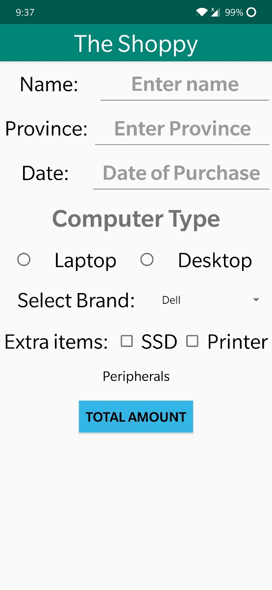
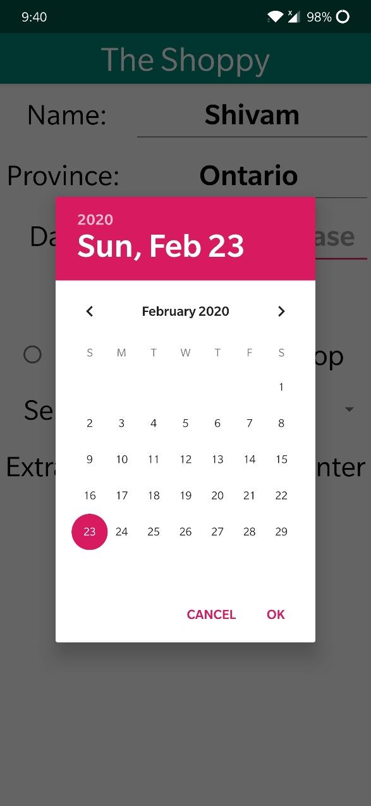
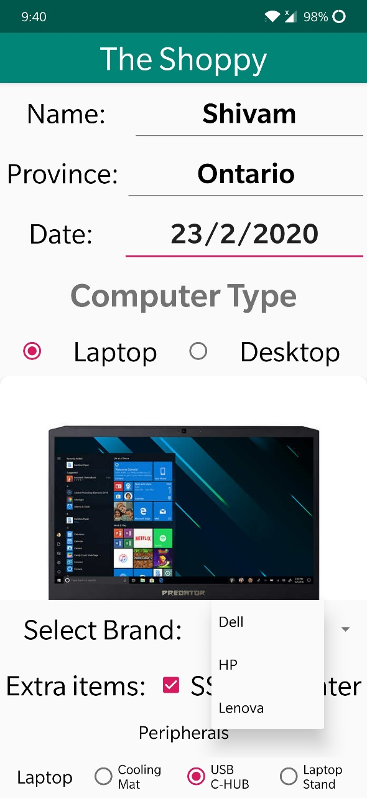
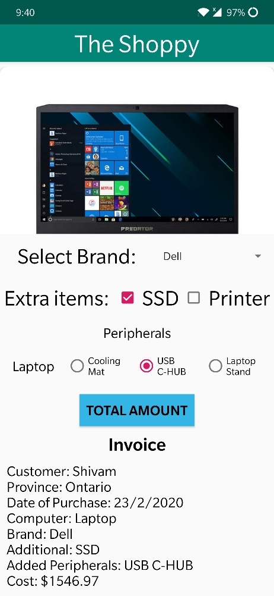

# TheShoppy
This application shows you the implementation of the standard GUI elements that you will encounter on the current generation of mobile phones.  
<b>Screenshots:</b>  
<b>1</b> 
  
<b>2</b> 
  
<b>3</b> 
  
<b>4</b> 

